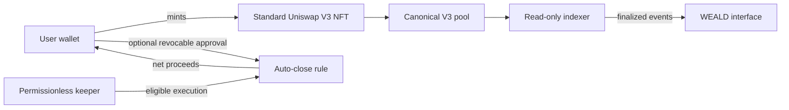

# WEALD Protocol

Public, read-only building blocks from [WEALD](https://weald.my), the liquidity automation interface for Robinhood Chain.

WEALD helps liquidity providers create concentrated-liquidity positions, monitor their ranges, understand route activity, and configure revocable price-targeted exits while their standard Uniswap V3 NFT stays in their wallet.

This repository publishes the parts that make WEALD easier to inspect and learn from:

- deterministic range and tick calculations;
- read-only position status classification;
- route-to-pool attribution for decoded swaps;
- architecture and security-boundary documentation;
- tests covering the public helpers.

It intentionally excludes signers, transaction broadcasters, keeper operations, production infrastructure, private routing policy, deployment tooling, and credentials.

## How the system fits together



The user remains the NFT owner. Read models can be rebuilt from chain events. An auto-close requires the registered conditions, current NFT approval, and a successful on-chain transaction.

## Public helpers

```js
import { classifyPosition, rangeFromTarget, summarizePoolTouches } from "./src/index.js";

const range = rangeFromTarget({
  currentTick: 12_000,
  targetMultiple: 3,
  tickSpacing: 60,
  direction: "up"
});

const status = classifyPosition({
  currentTick: 12_300,
  tickLower: range.tickLower,
  tickUpper: range.tickUpper,
  liquidity: 1000n
});

const touches = summarizePoolTouches(decodedSwapLegs, knownPools);
```

## Development

```bash
npm test
npm run check
```

## Important scope

These helpers prepare and explain data. They do not sign, submit, or guarantee transactions. Concentrated liquidity carries smart-contract, price, token, oracle, MEV, and impermanent-loss risk. Automated execution depends on chain conditions and available executors.

WEALD is an independent third-party project. It is not affiliated with or endorsed by Robinhood or Uniswap.
