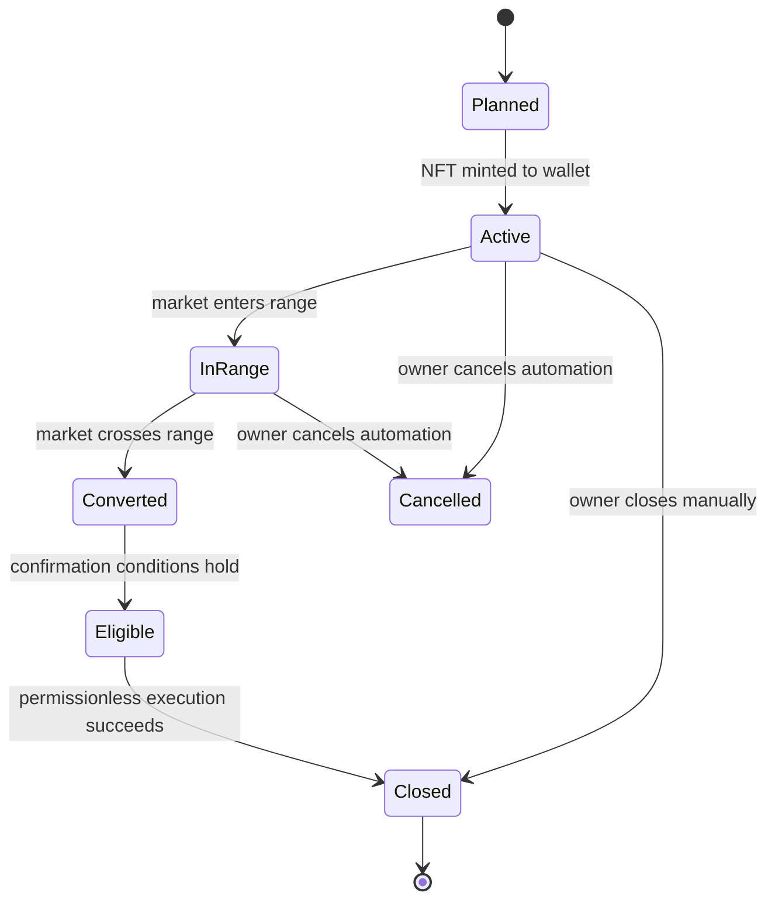

# Public architecture

## Trust boundaries

WEALD separates user-owned principal from derived data and automation policy.

1. Canonical Uniswap V3 contracts hold pool liquidity and mint position NFTs.
2. The wallet owns its NFT and can use compatible V3 tooling directly.
3. WEALD reads pool and position state, then prepares bounded user actions.
4. Optional closing rules record a position, target boundary, confirmation window, expiry, and minimum output.
5. Permissionless executors may call an eligible rule. The rule fixes settlement recipients on-chain.
6. Indexers, APIs, and interfaces present derived views. Contract state remains authoritative.

## Position lifecycle

## Route observation

A transaction may contain several swap legs. The public route helper matches decoded leg pool addresses against a known-pool catalog, groups repeated touches, and reports the observed input/output flow. This is an attribution view of decoded activity. It is not a trading quote or proof that a route was optimal.

## Published surface

The repository contains deterministic math and read-only classification. Production addresses, private infrastructure, operational thresholds, signer paths, and transaction execution remain outside this public surface.
